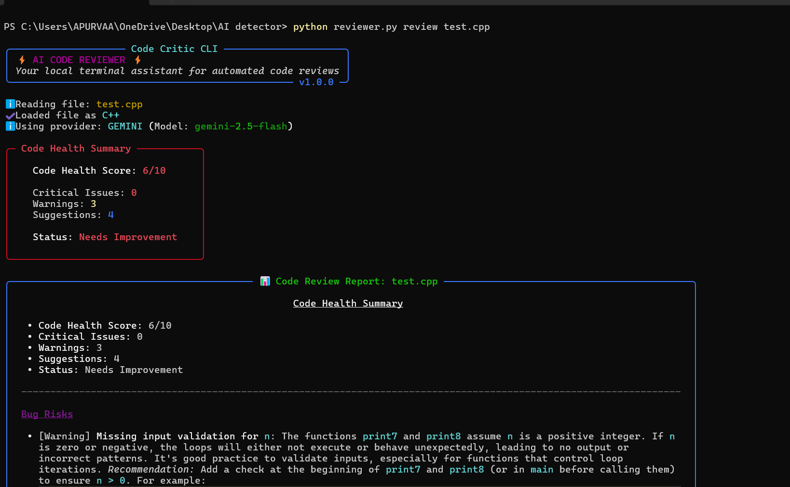
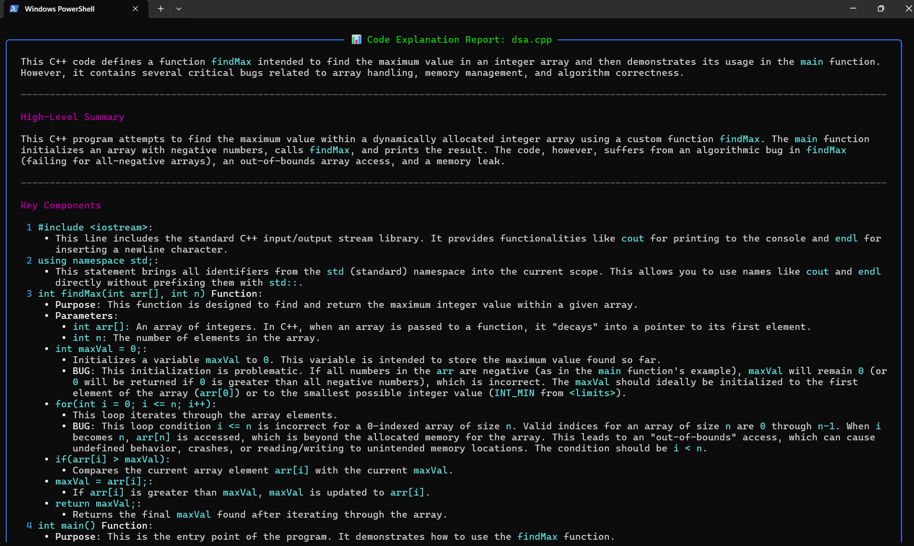
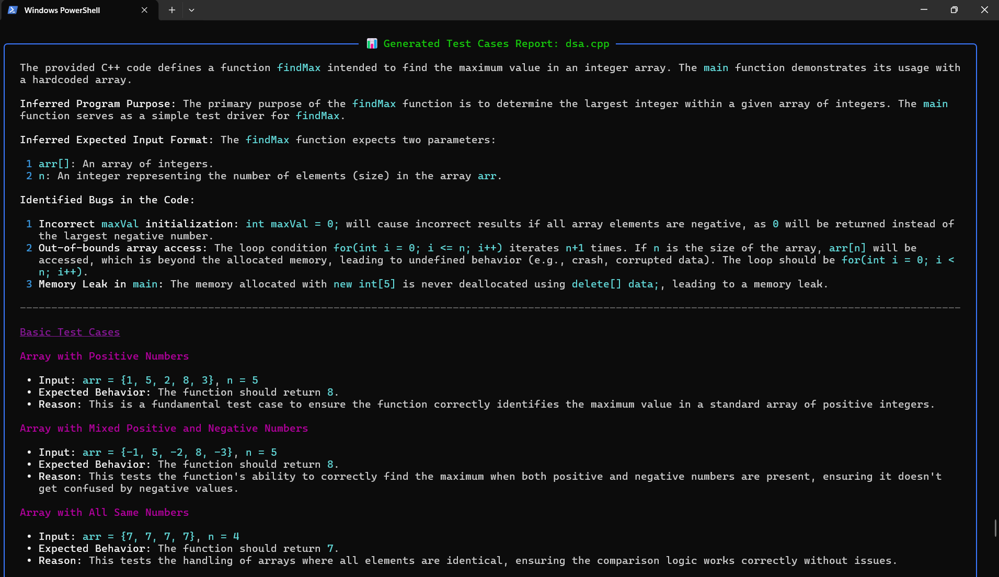

# Code Critic CLI ⚡

Code Critic CLI is an AI-powered terminal assistant built with Python and the Gemini/OpenAI APIs. It helps developers review source code, explain algorithms, analyze complexity, and generate high-quality test cases directly from the command line.

## Tech Stack

- Python
- Gemini API
- OpenAI API
- Rich
- Python Dotenv
- Argparse

It supports:
*   **Detailed Reviews**: Detects bug risks (e.g., memory leaks, segfaults), style violations, optimization opportunities, and calculates algorithm complexity.
*   **Interactive Outputs**: Renders syntax highlighting, status spinners, and responsive Markdown tables/panels directly in the terminal using the `rich` library.
*   **Export Capabilities**: Saves feedback reports to clean, standard Markdown files.
*   **Dual AI Providers**: Support for Google Gemini (default) and OpenAI with auto-detecting keys.

---

## 🚀 Key Features

*   **`review <file>`**: Evaluates code quality, flags bug risks, proposes style upgrades, and suggests performance gains.
*   **`explain <file>`**: Generates step-by-step documentation detailing what the source code does, how data flows, and sample usage.
*   **`complexity <file>`**: Calculates Big-O time and space complexity, critiques STL/data container choices, and flags performance bottlenecks under high loads.
*   **`testgen <file>`**: Generates structured, high-quality test cases automatically, covering basic inputs, edge cases, boundaries, and stress test ideas.
*   **Cross-platform Robustness**: Seamless terminal output on both UNIX and legacy Windows Command Prompts (with automatic Unicode-to-ASCII fallback rendering to prevent encoding errors).

---

## 🛠️ Project Structure

The project code is modular, well-commented, and structured like a production-grade library:

```
ai_detector/ (Workspace Root)
├── ai_reviewer/
│   ├── __init__.py        # Exposes metadata and version numbers
│   ├── cli.py             # Parses command-line arguments and routes controls
│   ├── config.py          # Handles environment keys (.env) and defaults
│   ├── file_handler.py    # Standardizes reading files & saving reports
│   ├── ai_client.py       # Wrapper classes for OpenAI and Gemini SDKs
│   ├── prompt_manager.py  # Generates language-specific prompts (.py, .cpp)
│   └── renderer.py        # Terminal rendering layouts and spinner status
├── test_samples/          # Dummy code files containing intentional issues
│   ├── sample_leak.cpp    # C++ file with heap leak & out of bounds bugs
│   └── sample_slow.py     # Python file with O(N^2) list nested lookups
├── tests/
│   └── test_cli.py        # Mock-based unit testing suite
├── reviewer.py            # Local python execution script
├── pyproject.toml         # Package definition allowing global executable installation
├── requirements.txt       # Dependencies (rich, openai, google-generativeai, python-dotenv)
└── README.md              # Detailed user setup & developer documentation
```

---

## 📥 Setup Instructions

### 1. Prerequisite
Ensure you have Python **3.8 or higher** installed.

### 2. Install Dependencies
Initialize your environment and install the required libraries:

```bash
pip install -r requirements.txt
```

### 3. Setup Environment Keys
1. Copy the `.env.example` template to `.env` in the project root:
   ```bash
   cp .env.example .env
   ```
2. Open `.env` and fill in your API key:
   *   **Google Gemini Key** (Free tier available): Create one at [Google AI Studio](https://aistudio.google.com/).
   *   **OpenAI API Key**: Generate one at [OpenAI Platform](https://platform.openai.com/).

```ini
AI_PROVIDER=gemini # 'gemini' or 'openai'
GEMINI_API_KEY=AIzaSy...
# Or:
# OPENAI_API_KEY=sk-proj-...
```

---

## 📦 Global CLI Installation (Optional)

Instead of running python scripts directly (`python reviewer.py ...`), you can install the reviewer as a global CLI tool that can be invoked using the command `reviewer` from anywhere on your machine:

```bash
pip install -e .
```

Now, you can execute commands globally:
```bash
reviewer review test_samples/sample_leak.cpp
```

---

## 💻 CLI Commands & Usage

### 1. Perform Code Reviews
Analyze C++, Python, or other source files for bug risks, style, and optimizations:
```bash
reviewer review test_samples/sample_leak.cpp
```
*Export to markdown:*
```bash
reviewer review test_samples/sample_leak.cpp --output reports/cpp_review.md
```

### 2. Generate Logic Explanations
Explain how a file works step-by-step:
```bash
reviewer explain test_samples/sample_slow.py
```

### 3. Analyze Algorithmic Complexity
Estimate time/space complexities and review container choice efficiency:
```bash
reviewer complexity test_samples/sample_slow.py
```

### 4. Generate Structured Test Cases
Infers the program's purpose and input format to automatically generate structured test cases grouped by Basic Cases, Edge Cases, Boundary Cases, and Stress Test Ideas:
```bash
reviewer testgen test_samples/sample_slow.py
```
*Export to markdown:*
```bash
reviewer testgen test_samples/sample_slow.py --output reports/python_tests.md
```

---

## ⚙️ Command Overrides

You can override your `.env` configuration directly using command line flags:

*   **Change AI Provider**: `-p` or `--provider` (`gemini` or `openai`)
*   **Change Model**: `-m` or `--model` (e.g. `gemini-2.5-pro` or `gpt-4o`)
*   **Export File**: `-o` or `--output` (path to save output file)

**Example:**
```bash
# Reviews a Python script using OpenAI's gpt-4o model and exports the output
reviewer review test_samples/sample_slow.py -p openai -m gpt-4o -o reports/openai_review.md
```

---

## 🧪 Running the Unit Tests

The project comes equipped with mock-based unit tests to verify the integrity of the CLI routing, configurations, file loading warnings, and markdown compilation:

```bash
python -m unittest tests/test_cli.py
```

---

## 📷 Screenshots

### Code Review



Shows bug detection, health scoring, and improvement suggestions.

### Explain Mode



Provides a beginner-friendly explanation of code, execution flow, and complexity analysis.

### Test Case Generation



Automatically generates basic, edge, boundary, and stress test cases.


# code-critic-cli
Code Critic CLI — A terminal-based AI developer assistant for code reviews, complexity analysis, explanations, and test case generation.

